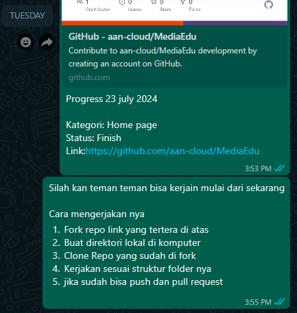
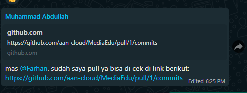
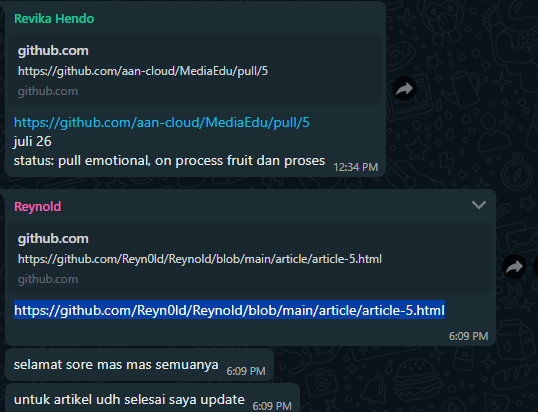

# Media Edu 📰

welcome to media edu app documentation This website was created for you to broaden your knowledge specifically in the field of education

### About

Edu media is a mass media service to provide education to students in the form of learning tips and tricks, health, thought patterns and hobbies, all of which are displayed in an article that has been written by several great students who are experienced in their fields. We hope the content What we present can provide benefits to readers.

The main reason this website was created was to fulfill the final assignment of the first semester at Asia Cyber University.With several team members that we have, we are determined to make this website as attractivepossible so that we can getsatisfactory grades.

The process of creating this website also places great importance on the quality of the UI and the content that is loaded. We have held several meetings on the Zoom application to start making plans and dividing tasks between each member.

In this project, our group consists of 4 people, namely Farhan, Revi, Abdul and Reynold. Each of them is an expert in creating websites and is familiar with using existing technology.

### application creation process

Before this application was created, it had gone through several important processes and we had documented the process

- #### Planing

  In the planning session, the four of us held a meeting on Zoom to discuss the application we wanted to make, design, find the UI, and divide tasks between each member in our team. You can acces the documentation of this session in [Youtube - Planing Project UAS Web-1](https://youtu.be/9dTtrp-_Als)

- #### Design

  The design was made as attractive and simple as possible, worked on for 2 days. You can access the design in [figma - Media Edu Design](https://www.figma.com/design/Mpqg26SeGFTgTrb2rVuZK0/Edu?node-id=0-1&t=Cdc98wJSRbHtu1fU-1)

- #### Building Process

  We use git and github media as tools for working as a team for the projects we create, every day there is always a process that we share in the WhatsApp group.

  - 
  - 
  - 

- #### Deployment and Domain

  We use Vercel to Deploy and get the free domain you can access in [vercel](https://vercel.com).

                        If a bug or error occurs, please contact the contact listed
